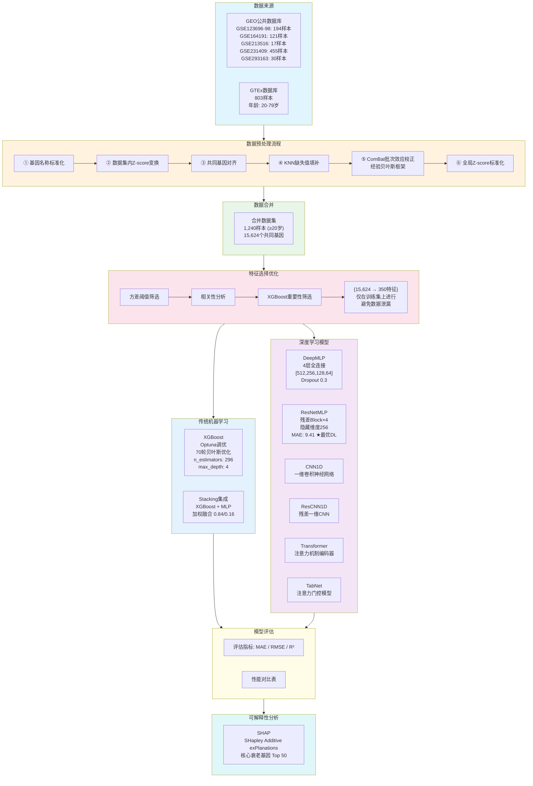
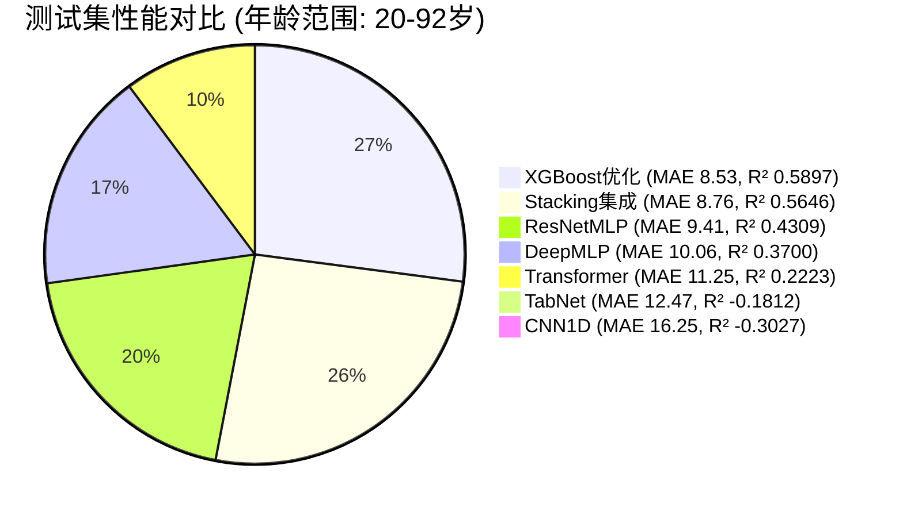
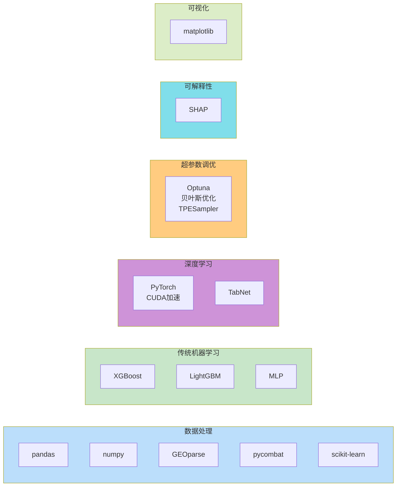

# 衰老时钟 (Aging Clock) 技术路线 - Mermaid 流程图

## 整体技术流程图

```mermaid
flowchart TB
    subgraph DATA["数据来源"]
        GEO["GEO公共数据库<br/>GSE123696-98: 194样本<br/>GSE164191: 121样本<br/>GSE213516: 17样本<br/>GSE231409: 455样本<br/>GSE293163: 30样本"]
        GTEx["GTEx数据库<br/>803样本<br/>年龄: 20-79岁"]
    end

    subgraph PREPROCESS["数据预处理流程"]
        P1["① 基因名称标准化"]
        P2["② 数据集内Z-score变换"]
        P3["③ 共同基因对齐"]
        P4["④ KNN缺失值填补"]
        P5["⑤ ComBat批次效应校正<br/>经验贝叶斯框架"]
        P6["⑥ 全局Z-score标准化"]

        P1 --> P2 --> P3 --> P4 --> P5 --> P6
    end

    subgraph MERGE["数据合并"]
        MERGE_BOX["合并数据集<br/>1,240样本 (≥20岁)<br/>15,624个共同基因"]
    end

    subgraph FEATURE["特征选择优化"]
        F1["方差阈值筛选"]
        F2["相关性分析"]
        F3["XGBoost重要性筛选"]
        F4["{15,624 → 350特征}<br/>仅在训练集上进行<br/>避免数据泄漏"]

        F1 --> F2 --> F3 --> F4
    end

    subgraph ML["传统机器学习"]
        XGB["XGBoost<br/>Optuna调优<br/>70轮贝叶斯优化<br/>n_estimators: 296<br/>max_depth: 4"]
        STACK["Stacking集成<br/>XGBoost + MLP<br/>加权融合 0.84/0.16"]
    end

    subgraph DL["深度学习模型"]
        MLP["DeepMLP<br/>4层全连接<br/>[512,256,128,64]<br/>Dropout 0.3"]
        RESNET_MLP["ResNetMLP<br/>残差Block×4<br/>隐藏维度256<br/>MAE: 9.41 ★最优DL"]
        CNN1D["CNN1D<br/>一维卷积神经网络"]
        RES_CNN["ResCNN1D<br/>残差一维CNN"]
        TRANS["Transformer<br/>注意力机制编码器"]
        TABNET["TabNet<br/>注意力门控模型"]
    end

    subgraph EVAL["模型评估"]
        METRICS["评估指标: MAE / RMSE / R²"]
        COMPARISON["性能对比表"]
    end

    subgraph EXPLAIN["可解释性分析"]
        SHAP["SHAP<br/>SHapley Additive exPlanations<br/>核心衰老基因 Top 50"]
    end

    DATA --> PREPROCESS
    PREPROCESS --> MERGE
    MERGE --> FEATURE
    FEATURE --> ML
    FEATURE --> DL
    ML --> EVAL
    DL --> EVAL
    EVAL --> EXPLAIN

    style DATA fill:#e1f5fe
    style PREPROCESS fill:#fff3e0
    style MERGE fill:#e8f5e9
    style FEATURE fill:#fce4ec
    style ML fill:#e3f2fd
    style DL fill:#f3e5f5
    style EVAL fill:#fffde7
    style EXPLAIN fill:#e0f7fa
```

---

## 模型性能对比图

```mermaid
pie title 测试集性能对比 (年龄范围: 20-92岁)
    "XGBoost优化 (MAE 8.53, R² 0.5897)" : 58.97
    "Stacking集成 (MAE 8.76, R² 0.5646)" : 56.46
    "ResNetMLP (MAE 9.41, R² 0.4309)" : 43.09
    "DeepMLP (MAE 10.06, R² 0.3700)" : 37.00
    "Transformer (MAE 11.25, R² 0.2223)" : 22.23
    "TabNet (MAE 12.47, R² -0.1812)" : 0
    "CNN1D (MAE 16.25, R² -0.3027)" : 0
```

---

## 技术栈概览

```mermaid
flowchart LR
    subgraph DATA["数据处理"]
        PD["pandas"]
        NP["numpy"]
        GEO["GEOparse"]
        COMBAT["pycombat"]
        SKL["scikit-learn"]
    end

    subgraph TRAD_ML["传统机器学习"]
        XGB["XGBoost"]
        LGB["LightGBM"]
        MLP_SKL["MLP"]
    end

    subgraph DEEP_L["深度学习"]
        TORCH["PyTorch<br/>CUDA加速"]
        TAB["TabNet"]
    end

    subgraph TUNE["超参数调优"]
        OPTUNA["Optuna<br/>贝叶斯优化<br/>TPESampler"]
    end

    subgraph EXPLAIN2["可解释性"]
        SHAP2["SHAP"]
    end

    subgraph VIZ["可视化"]
        MPL["matplotlib"]
    end

    style DATA fill:#bbdefb
    style TRAD_ML fill:#c8e6c9
    style DEEP_L fill:#ce93d8
    style TUNE fill:#ffcc80
    style EXPLAIN2 fill:#80deea
    style VIZ fill:#dcedc8
```
